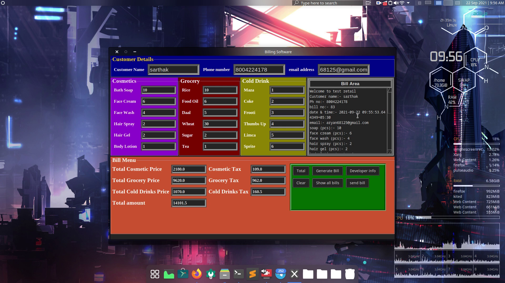
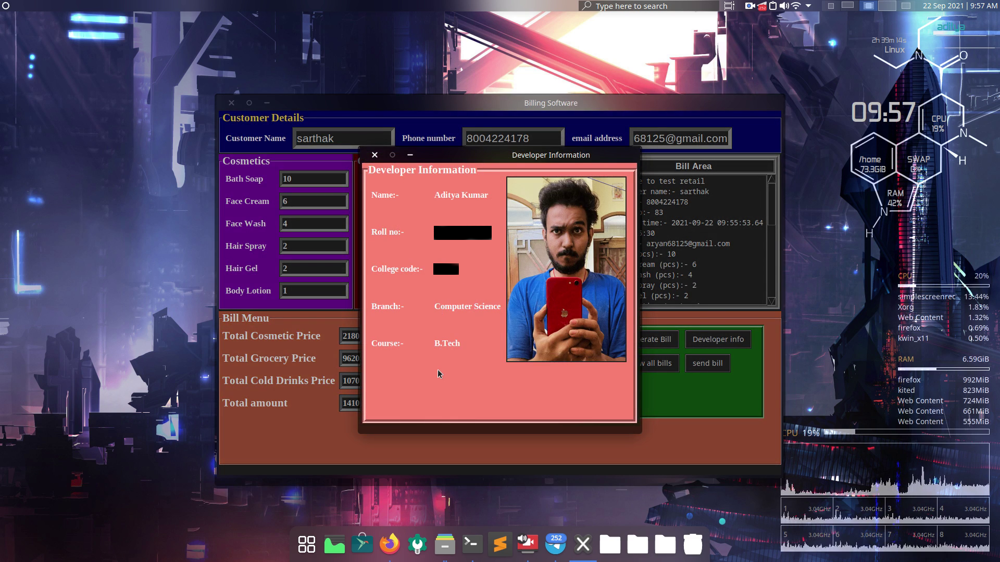
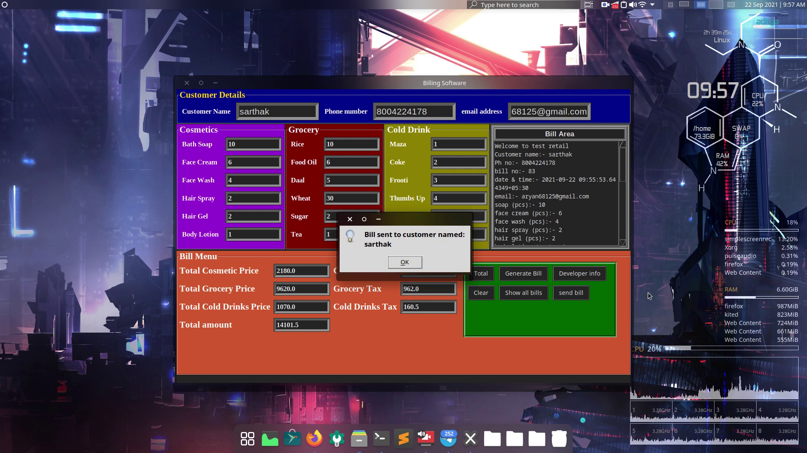
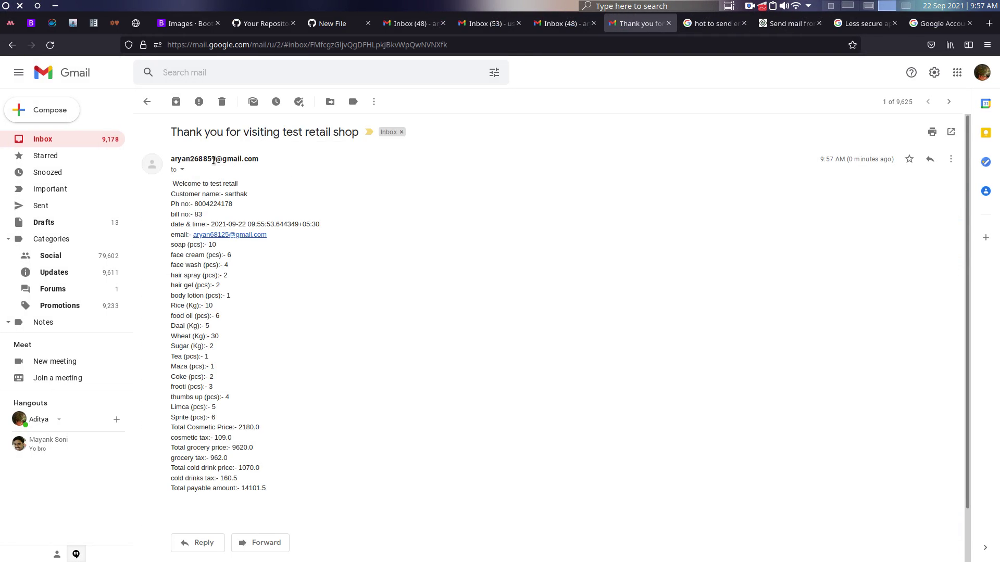
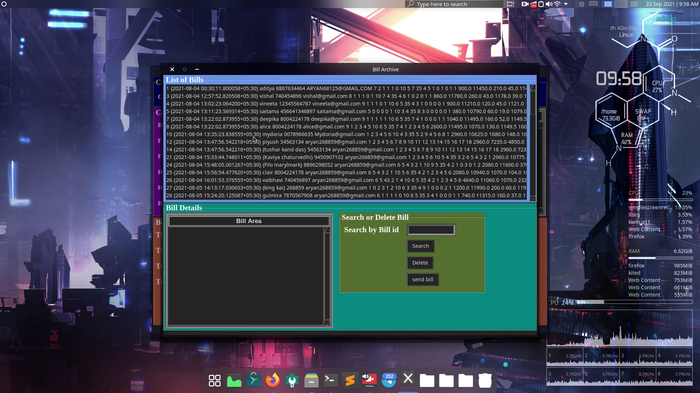
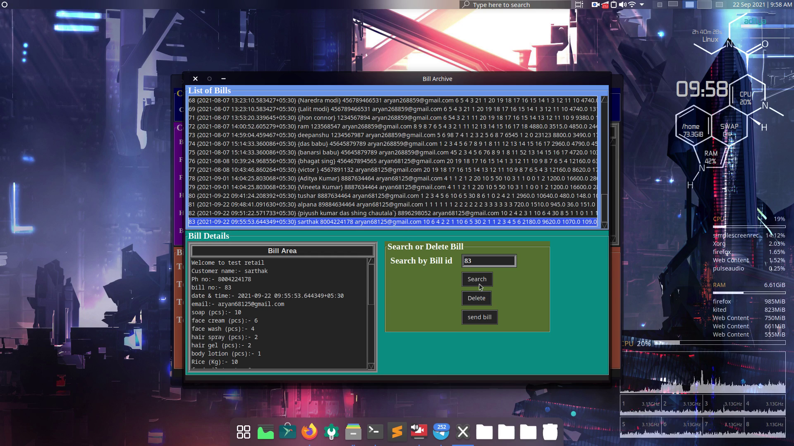

# billing_software
This application is a python app built for desktops using tkinter library that is inbuilt in python. 
For the database I used sqlLite database. It is a GUI desktop application 
It also have the ability to send the bill to the customer using their email adddress

Note:-
1. You need to extract rar file before you can run it via double click
2. This executable file will only run on windows os
3. Feel free to check the source code If you have any doubt

here are some snap shots:-

calculate total bill and then generate bill
 

developer info
 

sending bill to the customer via mail 
 
 

you can search for bills , delete bills , and resend bills to the customers via mail
 
 
